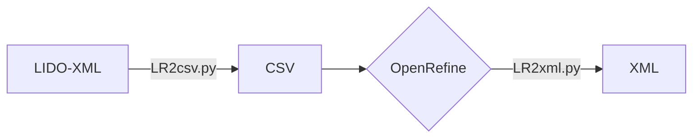
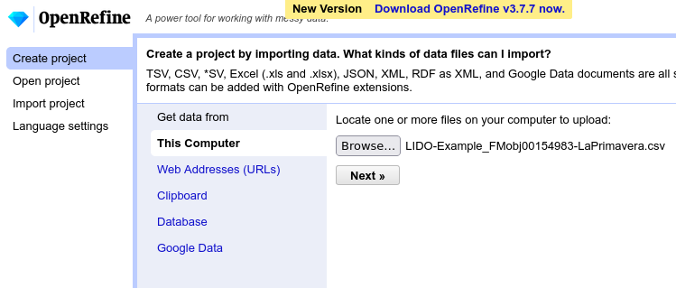
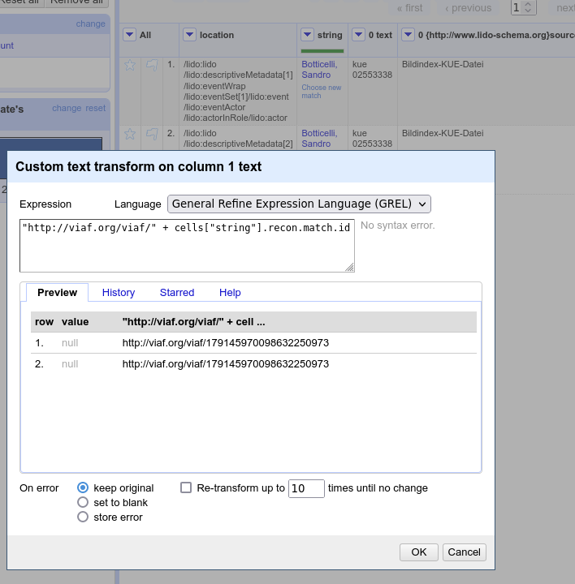

# LIDOrefine - Convert LIDO into CSV, enrich it in OpenRefine and convert it back into LIDO

## Setup

Clone the git repository and change into the `LIDOrefine` directory:

```bash
git clone git@github.com:alexander-winkler/LIDOrefine.git
cd LIDOrefine
```
Create a virutal environment (optional) and activate it:

```bash
mkdir .venv
python -m venv .venv
source .venv/bin/activate
```

Install the required packages:

```bash
pip install -r requirements.txt
```

The pipeline consists of two scripts.

`LR2csv.py` takes a LIDO XML and converts selected fields into a CSV file that can be modified using, e.g. OpenRefine.
`LR2xml.py` transforms the modified CSV back into a LIDO XML.



## LR2csv

example:

```python
python LR2csv.py -i inputLIDO.xml -a 3 -d outputdir
```

Converts the actor fields of the file `inputLIDO.xml` into csv and add 3 more actor columns. Write output into `outputdir/`. The directory is created if it does not exist. 

- `-h`/`--help`: print help text
- `-a <N>`: enrich actors, an optional number after `-a` adds `N` fields to the csv.
- `-p <N>`: enrich places. Again `<N>` adds `N` fields.
- `-i`/`--infile`: specify input file (mandatory)
- `-o`/`--outfile`: specify output filename, if not specified, the input filename is derived from input filename
- `-d`/`--targetdir`: specify folder where output is to be written. Folder is created if it doesn't exist. If this option is not provided, output is written in the current directory


### TODO

- add other fields
- allow SKOS

## LR2xml

example:

```python
python LR2xml.py -i refinedDoc.csv -x inputLIDO.xml
```

Write the modified data back into the LIDO XML file.

- `i`/`--infile`: The CSV file that has been modified.
- `x`/`--xml`: The original XML file the modified data is to be written into.
- `I`/`--infix`: String added to the output filename in order to avoid that the original file be overwritten. Default value: `_refined`. The above example thus produces an file with the filename `inputLIDO_refined.xml`

## Workflow

The original XML file (`LIDO-Example_FMobj00154983-LaPrimavera.xml`) resides in the directory `LIDOrefine` where the scripts are also located.

1. Generate a CSV extracting the actor fields:

```bash
python LR2csv.py -i LIDO-Example_FMobj00154983-LaPrimavera.xml
-a
```

The generated csv file is named `LIDO-Example_FMobj00154983-LaPrimavera.csv`.

2. Open OpenRefine, import the CSV and do the reconciling



3. Write the reconciliation results into the appropriate column



4. Export the results into a CSV file (the default name suggested by OpenRefine is `LIDO-Example-FMobj00154983-LaPrimavera-csv.csv`)


5. Insert the reconciled values from the CSV into the original LIDO XML. Note that the name of the original XML has to be specified as the CSV has a slightly different name now.

```bash
python LR2xml.py -i LIDO-Example-FMobj00154983-LaPrimavera-csv.csv -x LIDO-Example_FMobj00154983-LaPrimavera.xml
```

The result is `LIDO-Example_FMobj00154983-LaPrimavera_refined.xml`, an enriched version of the original LIDO.


