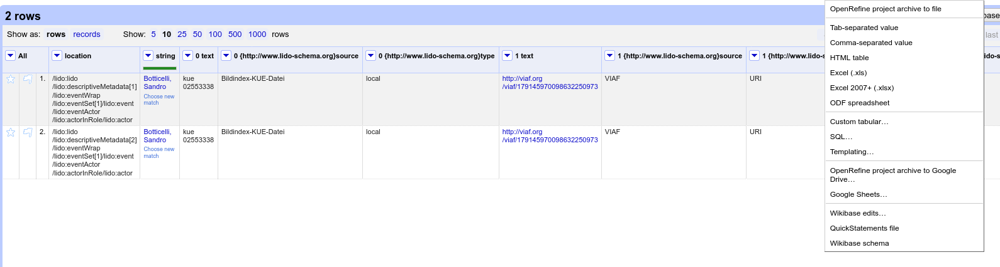

# LIDOrefine - Convert LIDO into CSV, enrich it in OpenRefine and convert it back into LIDO

## What's the point of LIDOrefine?

The use of controlled vocabularies via URIs is essential for producing high-quality metadata. Simply using a string to identify a creator, resource, or subject relevant to a resource's description has very limited usefulness, as it is not reliably machine-readable.

It is therefore vital for data providers in the GLAM sector to enrich their data with URIs that refer to controlled vocabularies. However, metadata often lacks references to controlled vocabularies, either due to software limitations that GLAMs are bound to use or because their workflows have not yet incorporated controlled vocabulary standards.

The [reconciliation workflow provided by OpenRefine](https://openrefine.org/docs/manual/reconciling) can help alleviate these difficulties by offering a straightforward and efficient way to link strings to controlled vocabularies via URIs.

That said, loading LIDO-XML files into OpenRefine is not entirely trivial, as these files often have a complex and nested hierarchy. Writing the reconciled data back to the XML file is even more challenging (to the best of my knowledge).

This is where LIDOrefine comes into play: it simplifies the process by extracting relevant elements from the nested LIDO-XML and projecting them into a tabular structure compatible with OpenRefine (this is handled by `LR2csv.py`).

Once the data is in a tabular format, it can be reconciled and enriched using standard OpenRefine workflows. After the enrichment process is complete, the updated data can be written back to the LIDO-XML file (`LR2xml.py` handles this). The result is a LIDO-XML file with metadata that contains URIs referring to controlled vocabularies.


## Setup

Clone the git repository and change into the `LIDOrefine` directory:

```bash
git clone git@github.com:alexander-winkler/LIDOrefine.git
cd LIDOrefine
```
Create a virutal environment (optional) and activate it:

```bash
mkdir .venv
python -m venv .venv
source .venv/bin/activate
```

Install the required packages:

```bash
pip install -r requirements.txt
```

The pipeline consists of two scripts.

`LR2csv.py` takes a LIDO XML and converts selected fields into a CSV file that can be modified using, e.g. OpenRefine.
`LR2xml.py` transforms the modified CSV back into a LIDO XML.


## LR2csv

example:

```python
python LR2csv.py -i inputLIDO.xml -a 3 -d outputdir
```

Converts the actor fields of the file `inputLIDO.xml` into csv and add 3 more actor columns. Write output into `outputdir/`. The directory is created if it does not exist. 

- `-h`/`--help`: print help text
- `-a <N>`: enrich actors, an optional number after `-a` adds `N` fields to the csv.
- `-p <N>`: enrich places. Again `<N>` adds `N` fields.
- `-s <N>`: enricht subjects.
- `-o <N>`: enrich objectWorktype.
- `-i`/`--infile`: specify input file (mandatory)
- `-O`/`--outfile`: specify output filename, if not specified, the input filename is derived from input filename
- `-d`/`--targetdir`: specify folder where output is to be written. Folder is created if it doesn't exist. If this option is not provided, output is written in the current directory


## LR2xml

example:

```python
python LR2xml.py -i refinedDoc.csv -x inputLIDO.xml
```

Write the modified data back into the LIDO XML file.

- `-i`/`--infile`: The CSV file that has been modified.
- `-x`/`--xml`: The original XML file the modified data is to be written into.
- `-I`/`--infix`: String added to the output filename in order to avoid that the original file be overwritten. Default value: `_refined`. The above example thus produces an file with the filename `inputLIDO_refined.xml`
- `-k`/`--keeptimestamp`: By default, every time the command is run, a modification timestamp is added. This behaviour can be disabled using this optional flag.

## Workflow

The original XML file (`LIDO-Example_FMobj00154983-LaPrimavera.xml`) resides in the directory `LIDOrefine` where the scripts are also located.

1. Generate a CSV extracting the actor fields:

```bash
python LR2csv.py -i LIDO-Example_FMobj00154983-LaPrimavera.xml
-a
```

The generated csv file is named `LIDO-Example_FMobj00154983-LaPrimavera.csv`.

2. Open OpenRefine, import the CSV and do the reconciling


3. Write the reconciliation results into the appropriate column


4. Export the results into a CSV file (the default name suggested by OpenRefine is `LIDO-Example-FMobj00154983-LaPrimavera-csv.csv`)



5. Insert the reconciled values from the CSV into the original LIDO XML. Note that the name of the original XML has to be specified as the CSV has a slightly different name now.

```bash
python LR2xml.py -i LIDO-Example-FMobj00154983-LaPrimavera-csv.csv -x LIDO-Example_FMobj00154983-LaPrimavera.xml
```

The result is `LIDO-Example_FMobj00154983-LaPrimavera_refined.xml`, an enriched version of the original LIDO.

## LIDOcombine.py

A simple helper application that takes a list of LIDO XML files and combines them into one single XML file.

Usage:

```bash
python LIDOcombine.py -o <OUTPUTFILE> <INPUT_1.xml>, <INDPUT_2.xm.> ...
```


### TODO

- add Exception Handling
- add other fields? 
- allow SKOS for full LIDO 1.1 support


## Possible Developments

- Bundle scripts into a standalone application without dependencies
- Offer the pipeline as a simple web application (upload XML, get CSV, modify CSV upload XML + CSV, get back the updated XML)
- Offer basic reconciliation for most commonly used fields and vocabularies in a web application (makes intermediary use of OpenRefine unnecessary)